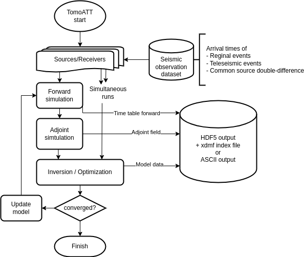

# Welcome to TomoATT's documentation!


TomoATT is a numerical library for adjoint-state travel-time tomography, which is developed for modeling :
- a very large and fine grid,
- large number of earthquake sources and stations in
- efficient and scalable way,

following a published article Ping Tong (2021) and Jing Chen (2022). 

Thanks to the efficiency of an eikonal equation solver, the computation of the travel-time is very fast and requires less amount of computational resources.
As an input data for TomoATT is travel times at seismic stations, we can easily prepare a great amount of input data for the computation.



For modeling a very large and fine grid with numerous seismic events, this library applies 3-layer parallelization, which are:
- layer 1: simulutaneous run parallelization (travel times for multiple seismic sources may be calculated simultaneously)
- layer 2: subdomain decomposition (If the number of computational nodes requires too large memory, we can separate the domain into subdomains and run each subdomain in a separate compute node)
- layer 3: sweeping parallelization (in each subdomain, sweeping layers are also parallelized)

The details of the parallelization method applied in this library are described in the paper [Miles Detrixhe and Frédéric Gibou (2016)](https://doi.org/10.1016/j.jcp.2016.06.023).

Regional events (sources within the global domain) and teleseismic events (sources outside the global domain) may be used for inversion.

Also, an optionzation for serial computation was also implemented in this library. Currently AVX, AVX2, AVX512 for intel processors and SVE for ARM processors are supported.


```{toctree}
:maxdepth: 1
:hidden:

install/index
tutorial/index
examples/index
```